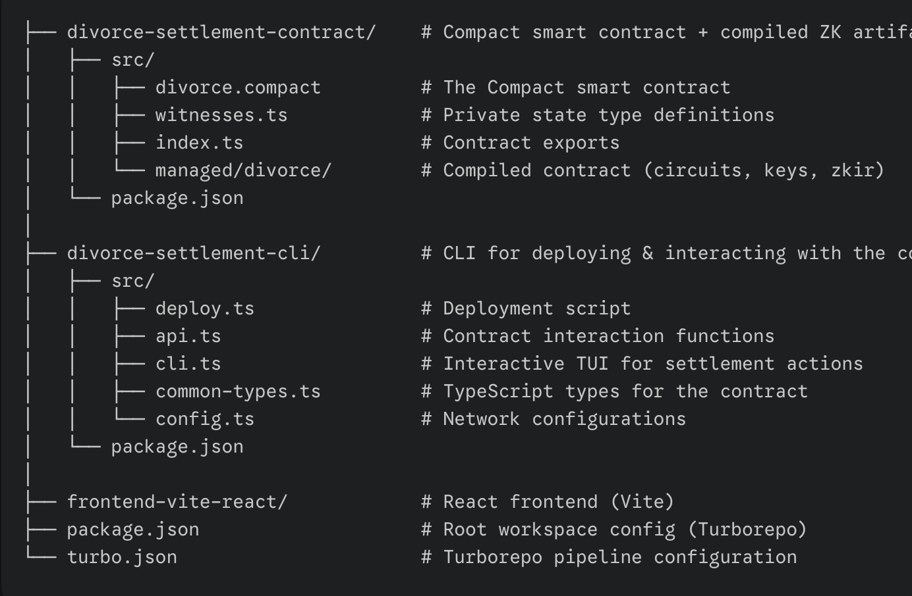

# Divorce Settlement Tracker

A privacy-preserving smart contract built on the **Midnight Network** that enables divorcing parties to track compliance with settlement terms on-chain — while keeping amounts and conditions hidden from public court records.

## Overview

Traditional divorce settlements rely on paper trails and court filings that expose sensitive financial details. This dApp leverages Midnight's zero-knowledge proof technology to allow both parties to **privately confirm compliance** with settlement terms without revealing the underlying data to anyone — not even the blockchain's public ledger.

### How It Works

Party A confirms compliance ──► ZK Proof generated (private witness hidden)
│
Party B confirms compliance ──► ZK Proof generated (private witness hidden)
│
Both confirmed? ──────────────► Settlement finalized on-chain ✓

1. **Party A** submits a private proof of compliance (the proof itself is never revealed on-chain)
2. **Party B** independently submits their private proof of compliance
3. Once **both parties** have confirmed, either party can call `finalizeSettlement()` to mark the settlement as complete
4. The public ledger only shows _whether_ each party confirmed and _whether_ the settlement is finalized — never the underlying terms, amounts, or conditions

## Tech Stack

| Component               | Technology                                           |
| ----------------------- | ---------------------------------------------------- |
| Smart Contract Language | [Compact](https://docs.midnight.network/)            |
| Blockchain              | [Midnight Network](https://midnight.network/)        |
| ZK Proving              | Midnight ZK Circuits (Halo2-based)                   |
| Frontend                | React + Vite                                         |
| CLI / Deployment        | TypeScript, ts-node                                  |
| Wallet SDK              | Midnight Wallet SDK (HD, Shielded, Unshielded, Dust) |
| Build System            | Turborepo + npm workspaces                           |

## Project Structure

## Smart Contract

The contract is written in **Compact** (`divorce.compact`) and exposes three circuits:

| Circuit                              | Description                                                                                          |
| ------------------------------------ | ---------------------------------------------------------------------------------------------------- |
| `confirmByPartyA(proofOfCompliance)` | Party A privately proves compliance. The proof is a private witness — hidden from the public ledger. |
| `confirmByPartyB(proofOfCompliance)` | Party B privately proves compliance. Same privacy guarantees.                                        |
| `finalizeSettlement()`               | Marks the settlement as complete. Requires both parties to have confirmed first.                     |

**Public Ledger State** (visible on-chain):

| Field             | Type      | Description                                   |
| ----------------- | --------- | --------------------------------------------- |
| `isSettled`       | `Uint<8>` | `1` if settlement is finalized, `0` otherwise |
| `partyAConfirmed` | `Uint<8>` | `1` if Party A confirmed compliance           |
| `partyBConfirmed` | `Uint<8>` | `1` if Party B confirmed compliance           |

> The actual compliance data (amounts, conditions, terms) is **never** stored or revealed on-chain. Only the boolean confirmation status is public.

## Privacy Guarantees

| What's Public                   | What's Private                             |
| ------------------------------- | ------------------------------------------ |
| Whether Party A confirmed       | The compliance proof itself                |
| Whether Party B confirmed       | Settlement terms and conditions            |
| Whether settlement is finalized | Financial amounts                          |
| Contract address                | Party identities (beyond wallet addresses) |

The ZK circuits ensure that a party can only confirm compliance by providing a valid private witness (`proofOfCompliance == 1`). The proof is verified on-chain without ever revealing the witness value.

## Prerequisites

- [Node.js](https://nodejs.org/) (v18+) & [npm](https://www.npmjs.com/) (v10+)
- [Docker](https://docs.docker.com/get-docker/)
- [Git LFS](https://git-lfs.com/) (for large ZK proving key files)
- [Compact Compiler](https://docs.midnight.network/relnotes/compact-tools) (Midnight developer tools)
- [Lace Wallet](https://chromewebstore.google.com/detail/hgeekaiplokcnmakghbdfbgnlfheichg?utm_source=item-share-cb) (browser extension — for frontend usage)

## Known Issues

- There's a not-yet-fixed bug in the arm64 Docker image of the proof server.
- Workaround: Use Bricktower proof server — **bricktowers/proof-server:6.1.0-alpha.6**

## Getting Started

### 1. Install Git LFS

\`\`\`bash
sudo dnf install git-lfs # Fedora/RHEL

# or: brew install git-lfs # macOS

git lfs install
\`\`\`

### 2. Install Compact Tools

\`\`\`bash
curl --proto '=https' --tlsv1.2 -LsSf \
 https://github.com/midnightntwrk/compact/releases/latest/download/compact-installer.sh | sh
\`\`\`

### 3. Install Dependencies

\`\`\`bash
npm install
\`\`\`

### 4. Compile the Contract

\`\`\`bash
cd divorce-settlement-contract
npm run compact
\`\`\`

This compiles `divorce.compact` into ZK circuits, proving keys, and TypeScript bindings under `src/managed/divorce/`.

### 5. Build the Project

\`\`\`bash

# From the project root

npm run build
\`\`\`

### 6. Deploy the Contract

\`\`\`bash
cd divorce-settlement-cli
npm run deploy
\`\`\`

The interactive deployment script will prompt you to:

1. Select a network (**Local**, **Preview**, or **Preprod**)
2. Provide a wallet seed (or use the default genesis seed for local)
3. Wait for wallet sync and fund confirmation
4. Deploy the contract

On success, the contract address is saved to `divorce-settlement-cli/deployment.json`.

### 7. Interact via CLI

\`\`\`bash
cd divorce-settlement-cli

# Local standalone

npm run tui-undeployed

# Preview testnet

npm run tui-preview

# Preprod testnet

npm run tui-preprod
\`\`\`

The interactive TUI provides a menu to:

- Deploy or join a settlement contract
- Confirm compliance as Party A or Party B
- Finalize the settlement
- View current settlement status

### 8. Start the Frontend

\`\`\`bash
npm run dev:frontend
\`\`\`

## Deployment

The contract has been deployed and verified on the **Preprod** testnet:

| Field                | Value                                                              |
| -------------------- | ------------------------------------------------------------------ |
| **Contract Address** | `822abc2d9740bb00f93861e7d9e804a48c2beb16c04d1c17f7f0ca0b8479695f` |
| **Network**          | Preprod                                                            |
| **Deployed At**      | 2026-02-14                                                         |

## Network Configuration

| Network     | Indexer                                    | Node RPC                               | Proof Server            |
| ----------- | ------------------------------------------ | -------------------------------------- | ----------------------- |
| **Local**   | `http://127.0.0.1:8088`                    | `http://127.0.0.1:9944`                | `http://127.0.0.1:6300` |
| **Preview** | `https://indexer.preview.midnight.network` | `https://rpc.preview.midnight.network` | `http://127.0.0.1:6300` |
| **Preprod** | `https://indexer.preprod.midnight.network` | `https://rpc.preprod.midnight.network` | `http://127.0.0.1:6300` |

> **Note:** The proof server always runs locally. Start it with Docker before deploying:
> \`\`\`bash
> cd divorce-settlement-cli
> npm run ps-undeployed # or ps-preview
> \`\`\`

## Scripts Reference

### Root

| Script                 | Description                   |
| ---------------------- | ----------------------------- |
| `npm run compact`      | Compile all Compact contracts |
| `npm run build`        | Build all packages            |
| `npm run lint`         | Lint all packages             |
| `npm run dev:frontend` | Start the React dev server    |

### divorce-settlement-contract

| Script            | Description                               |
| ----------------- | ----------------------------------------- |
| `npm run compact` | Compile `divorce.compact`                 |
| `npm run build`   | Build TypeScript + copy managed artifacts |
| `npm run test`    | Run contract tests                        |

### divorce-settlement-cli

| Script                   | Description                       |
| ------------------------ | --------------------------------- |
| `npm run deploy`         | Deploy the contract (interactive) |
| `npm run tui-undeployed` | Launch CLI on local network       |
| `npm run tui-preview`    | Launch CLI on Preview testnet     |
| `npm run tui-preprod`    | Launch CLI on Preprod testnet     |

## License

Apache-2.0

---

  
Built with ❤️ on <a href="https://midnight.network/">Midnight Network</a> — Privacy-preserving smart contracts powered by zero-knowledge proofs

